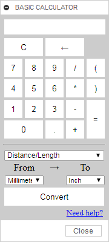

#  Fusion 360 - Basic calculator
An add-in that displays a basic calculator in Autodesk Fusion 360.

## Installation

Download and install the GitHub2Fusion360 add-in ([Windows](https://apps.autodesk.com/FUSION/fr/Detail/Index?id=789800822168335025&appLang=en&os=Win64) or [Mac](https://apps.autodesk.com/FUSION/fr/Detail/Index?id=789800822168335025&os=Mac&appLang=en)) available for free on the Autodesk App Store.

Run the GitHub2Fusion360 add-in in Fusion 360 and copy/paste the URL of the repo: [https://github.com/JeromeBriot/fusion360-basic-calculator](https://github.com/JeromeBriot/fusion360-basic-calculator)

## Usage

Run the BasicCalculator add-in and you should see a new button with a green icon () on the quick access toolbar on the upper right corner of the Fusion 360 UI. Click on the button to toggle the visibility of the calculator panel.

## License
Codes are licensed under the terms of the BSD-2-Clause License. Please see the License.txt file for full details.
